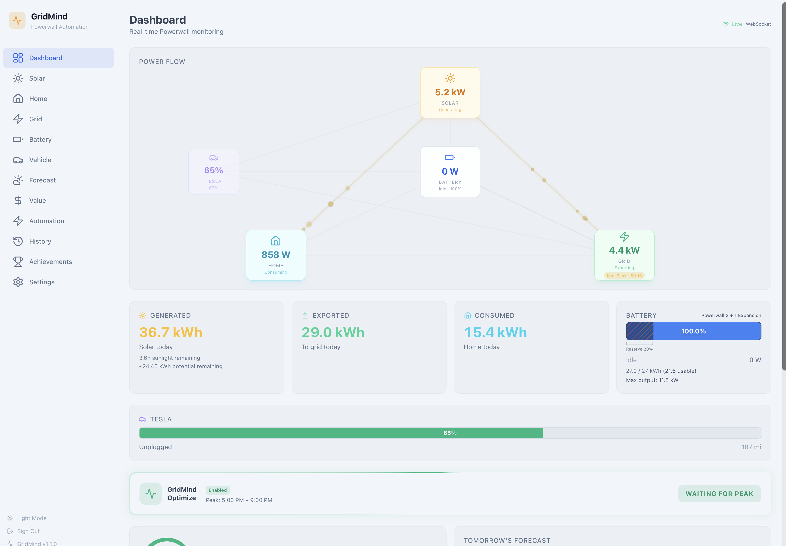
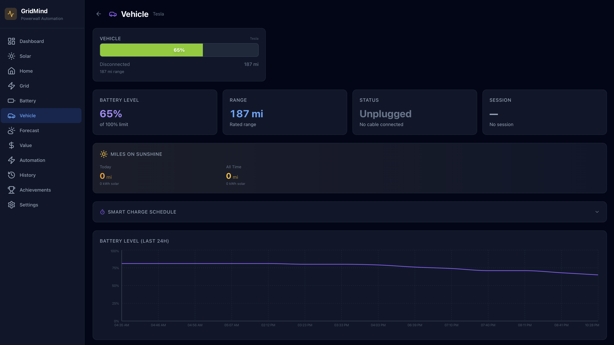
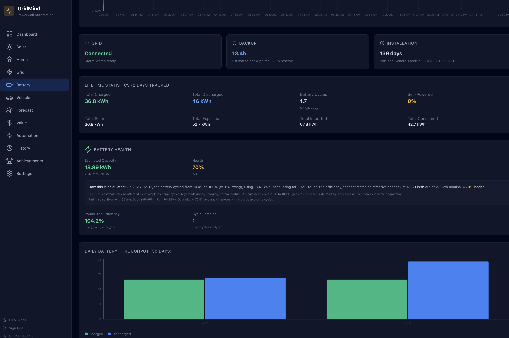
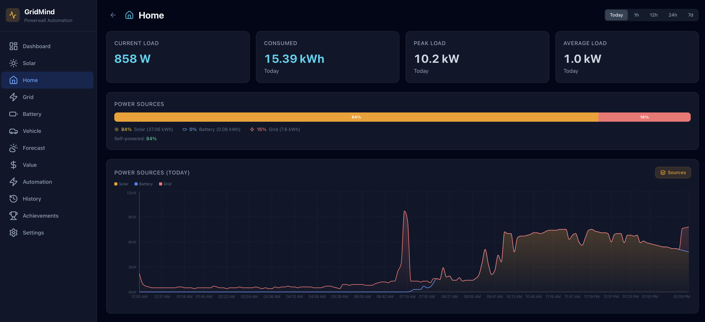
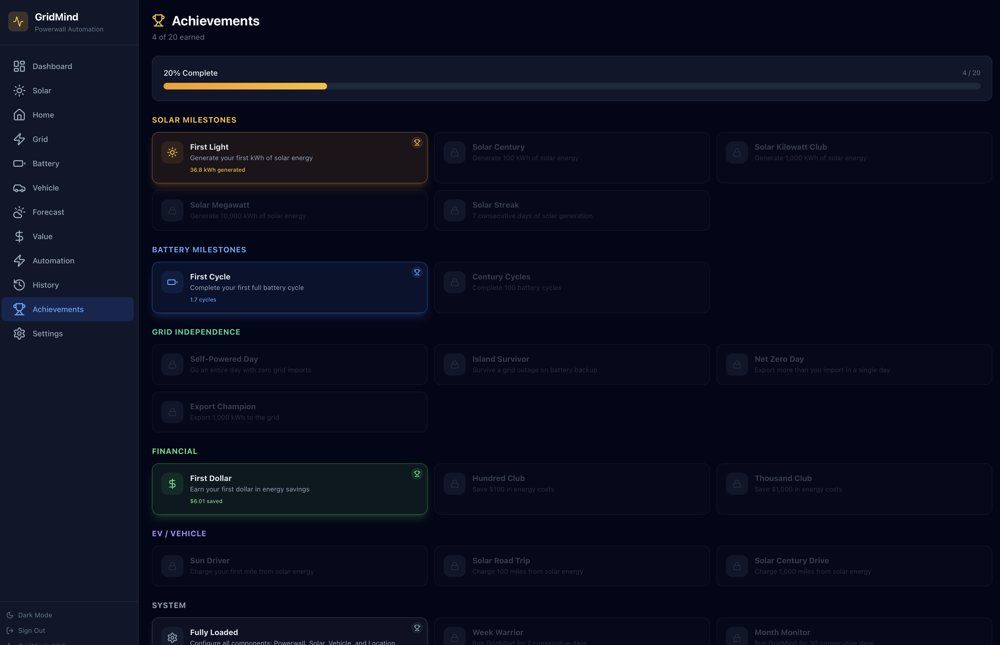

<p align="center">
  
</p>

<h1 align="center">GridMind</h1>

<p align="center">
  <strong>Personal Tesla Powerwall 3 automation and monitoring app</strong><br>
  Real-time power flow · EV charging · Solar forecasting · Smart export optimization<br>
  <a href="https://buymeacoffee.com/smidley">
    
  </a>
  
  
  
</p>

---

GridMind gives you full control over your Tesla Powerwall with a beautiful real-time dashboard, intelligent automation, EV charging integration, and AI-powered insights — all running as a self-hosted Docker container.

## Screenshots

<table>
  <tr>
    <td><br><em>Dashboard with power flow</em></td>
    <td><br><em>Light mode</em></td>
  </tr>
  <tr>
    <td><br><em>EV charging & Wall Connector</em></td>
    <td><br><em>Battery health & diagnostics</em></td>
  </tr>
  <tr>
    <td><br><em>Home power source breakdown</em></td>
    <td><br><em>Achievements & badges</em></td>
  </tr>
</table>

## Quick Start

```bash
# Pull and run (no build required)
docker run -d \
  --name gridmind \
  -p 8080:8000 \
  -v /path/to/data:/app/data \
  --restart unless-stopped \
  ghcr.io/smidley/gridmind:latest

# Open the dashboard
open http://localhost:8080
```

Or with Docker Compose:

```yaml
services:
  gridmind:
    image: ghcr.io/smidley/gridmind:latest
    ports:
      - "8080:8000"
    volumes:
      - ./data:/app/data
    restart: unless-stopped
```

Then follow the setup wizard in Settings. **All configuration is done through the web UI — no environment variables needed.**

## Features

### Real-Time Dashboard
An animated canvas-based power flow diagram shows energy moving between Solar, Battery, Home, Grid, and your EV in real-time. Particle count, size, and speed scale with actual wattage. Daily totals, battery gauge with SOC-tier colors, TOU rate indicator, solar goal ring, and today's net value — all at a glance.

### EV Charging Integration
Discover your Tesla vehicle automatically. Monitor charge state, range, and power in real-time. Start/stop charging and adjust the charge limit from the web UI. See exactly where your charging power comes from (Solar, Battery, or Grid) with a live proportional breakdown. Track "Miles on Sunshine" — how many miles you've charged from solar energy.

**Smart Charge Scheduling:**
| Strategy | How it works |
|---|---|
| **TOU-Aware** | Pauses charging during peak rates, resumes off-peak |
| **Solar Surplus** | Only charges from excess solar, dynamically adjusts amps |
| **Departure Planner** | Calculates optimal start time for your target SOC by departure |
| **Hybrid Limit** | Any source to 80%, then solar-only to 100% (configurable) |

### Wall Connector
Live status of your Tesla Gen 3 Wall Connector: power output, connection state, health monitoring, serial number, and fault detection.

### GridMind Optimize
Smart peak export strategy that maximizes your TOU export credits. Holds battery during peak hours, calculates the optimal moment to export based on battery SOC, home load, and time remaining, then dumps to grid at max rate. The dashboard shows a live "How It's Thinking" panel with the calculation breakdown.

### Solar Forecasting
Free 7-day solar forecast via Open-Meteo using Global Tilted Irradiance (GTI) calibrated to your panel tilt and azimuth. Forecast vs actual overlay chart. Tomorrow's prediction with weather conditions.

### Powerwall Health
Battery capacity estimation from charge cycles, round-trip efficiency tracking, peak power trends, and degradation monitoring over time. Grid outage detection, low SOC alerts, firmware update alerts, and Storm Watch notifications. Lifetime statistics with daily throughput charts. Full hardware inventory.

### AI Insights (Optional)
Add your OpenAI API key to get AI-powered energy observations, optimization tips, and anomaly detection. Uses gpt-4o-mini (~$0.01/day). Completely optional — all features work without it.

### Energy Value
Track your financial performance: export credits, import costs, net value, solar savings. Hourly value timeline, cumulative curve with TOU period bands, export timing heatmap, and detailed TOU period summary.

### Achievements
22 badges across 6 categories: Solar milestones, Battery cycles, Grid independence, Financial goals, EV solar miles, and System uptime. Progress bar and earned/locked badge grid.

### Automation
Create rules with triggers (time, SOC, load, solar, grid status) and actions (set mode, reserve, storm mode, grid charging, export rule, notifications). 7 preset templates included.

### Additional Features
- **Light/Dark Mode** — Auto-follows OS, manual toggle
- **Off-Grid Mode** — Simulate grid disconnect with one click
- **Time Range Selector** — View data for Today, 1h, 12h, 24h, or 7d on all detail pages
- **Power Source Breakdown** — See Solar/Battery/Grid percentages with stacked chart toggle
- **Notifications** — Email (SMTP) and webhooks (Slack/Discord) — configured in the web UI
- **App Authentication** — Password login with rate limiting for secure remote access
- **Mobile Responsive** — Bottom nav bar with expandable menu, scales to any screen size
- **Auto-Refresh** — Data refreshes instantly when you unlock your phone or switch tabs

## Setup Guide

### Step 1: Register a Tesla Developer App

1. Go to [developer.tesla.com](https://developer.tesla.com) and sign in
2. Create a new Fleet API application:
   - **App name**: GridMind
   - **OAuth Grant Type**: Authorization Code and Machine-to-Machine
   - **Allowed Origin URLs**: `http://localhost:8080`
   - **Allowed Redirect URI**: `http://localhost:8080/auth/callback`
   - **Scopes**: `Energy Product Information`, `Energy Product Commands`
   - **For EV features** (optional): also enable `Vehicle Information` and `Vehicle Charging Management`
3. Save your **Client ID** and **Client Secret**

> **Running on a server (Unraid, etc.)?** Use your server's URL for the redirect URI (e.g., `https://gridmind.yourdomain.com/auth/callback`). Tesla only allows `http://` for localhost — remote servers need HTTPS via a reverse proxy. See [Unraid Installation](#unraid-installation) below.

### Step 2: Enter Credentials

Open GridMind in your browser and go to **Settings**. Enter your Client ID, Client Secret, and Redirect URI.

### Step 3: Generate & Host Public Key

Tesla requires a public key at a public URL. GridMind generates the key pair for you.

1. Click **Generate Keys** in Settings
2. Copy the public key
3. Host it at: `https://YOUR-DOMAIN/.well-known/appspecific/com.tesla.3p.public-key.pem`

**Easiest method — GitHub Pages (free, 2 minutes):**
1. Create or use your `yourusername.github.io` repo
2. Create `.well-known/appspecific/com.tesla.3p.public-key.pem` with the key content
3. Add an empty `.nojekyll` file in the repo root
4. Push and verify the URL works

### Step 4: Register, Authenticate & Discover

1. Enter your domain and click **Register**
2. Click **Authenticate with Tesla** — complete the OAuth flow
3. Click **Discover Site** to find your Powerwall

### Step 5: Configure Location & Solar

1. Enter your address — auto-geocoded for solar forecasting
2. Configure panel specs (capacity, tilt, azimuth, efficiency)

### Step 6: Vehicle Setup (Optional)

Go to the **Vehicle** page and select your Tesla. Charge monitoring, controls, and the dashboard EV node will activate.

> **Need to add vehicle scopes later?** Revoke GridMind at [tesla.com/teslaaccount](https://www.tesla.com/teslaaccount) → Security → Third-Party Apps, then re-authenticate.

### Step 7: Enable Authentication (Recommended)

Go to **Settings** → **App Authentication** and set a username/password. Required if accessing GridMind over the internet.

## Unraid Installation

**Option A — Community Apps:**
1. Go to **Apps** → **Settings** (gear icon)
2. Add template repository: `https://github.com/smidley/unraid-templates`
3. Search "GridMind" and install

**Option B — Manual:**
1. **Docker** → **Add Container**
2. **Repository**: `ghcr.io/smidley/gridmind:latest`
3. Add **Port**: Host `8080` → Container `8000` (TCP)
4. Add **Path**: Host `/mnt/user/appdata/gridmind` → Container `/app/data` (RW)
5. Click **Apply**

> **Important**: For OAuth, set up HTTPS via Nginx Proxy Manager or similar. Tesla requires HTTPS for non-localhost redirect URIs. Use your HTTPS domain as the redirect URI in both the Tesla Developer App and GridMind Settings.

## Data Persistence

All data is stored in the Docker volume at `/app/data/`:

| File | Contents |
|---|---|
| `setup.json` | All settings: Tesla credentials, location, solar config, vehicle, schedules, notifications, OpenAI key |
| `tesla_tokens.json` | OAuth access and refresh tokens |
| `gridmind.db` | SQLite: energy readings, vehicle charge history, automation rules, forecasts, achievements |
| `private-key.pem` | EC private key for Fleet API |
| `public-key.pem` | EC public key (hosted on your domain) |

**Back up `/app/data/` to preserve all settings and history.**

## Development

```bash
# Backend
cd backend
python -m venv .venv && source .venv/bin/activate
pip install -r requirements.txt
python main.py  # http://localhost:8000

# Frontend
cd frontend
npm install
npm run dev  # http://localhost:5173
```

## Tech Stack

- **Backend**: Python 3.12, FastAPI, SQLAlchemy (async SQLite), APScheduler
- **Frontend**: React 18, TypeScript, Vite, Tailwind CSS, Recharts
- **Deployment**: Docker (multi-stage), GitHub Actions CI (GHCR, multi-arch)
- **APIs**: Tesla Fleet API, Open-Meteo, OpenAI (optional)

## Support

If GridMind is useful to you, consider buying me a coffee:

<a href="https://buymeacoffee.com/smidley">
  
</a>

## License

MIT License. Not affiliated with Tesla, Inc.
